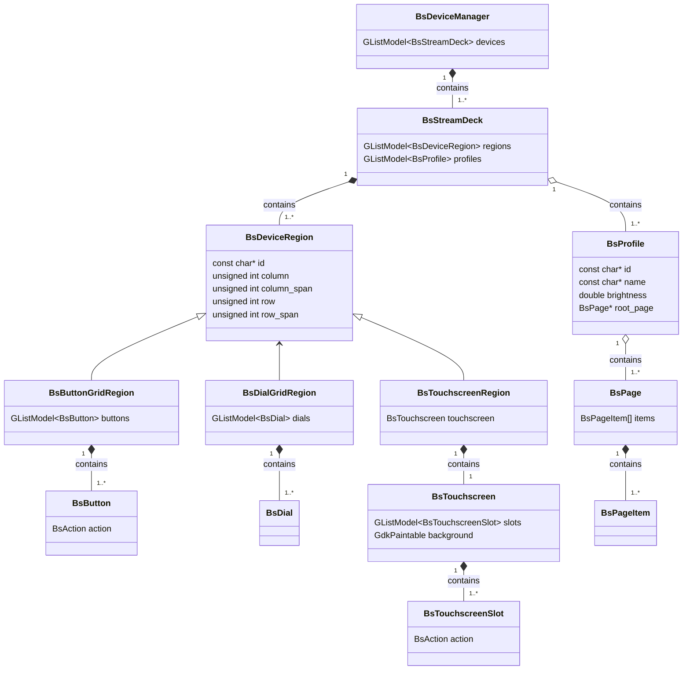

```mermaid

classDiagram
    
    class BsDeviceManager {
        GListModel~BsStreamDeck~ devices
    }

        class BsStreamDeck {
            GListModel~BsDeviceRegion~ regions
            GListModel~BsProfile~ profiles
        }
        BsDeviceManager "1" *-- "1..*" BsStreamDeck : contains

            class BsDeviceRegion {
                const char* id
                unsigned int column
                unsigned int column_span
                unsigned int row
                unsigned int row_span
            }
            BsStreamDeck "1" *-- "1..*" BsDeviceRegion : contains

                class BsButtonGridRegion {
                    GListModel~BsButton~ buttons
                }
                BsDeviceRegion <|-- BsButtonGridRegion

                    class BsButton {
                        BsAction action
                    }
                    BsButtonGridRegion "1" *-- "1..*" BsButton : contains

                class BsDialGridRegion {
                    GListModel~BsDial~ dials
                }
                BsDeviceRegion <-- BsDialGridRegion

                    class BsDial {
                    }
                    BsDialGridRegion "1" *-- "1..*" BsDial : contains

                class BsTouchscreenRegion {
                    BsTouchscreen touchscreen
                }
                BsDeviceRegion <|-- BsTouchscreenRegion

                    class BsTouchscreen {
                        GListModel~BsTouchscreenSlot~ slots
                        GdkPaintable background
                    }
                    BsTouchscreenRegion "1" *-- "1" BsTouchscreen : contains


                        class BsTouchscreenSlot {
                            BsAction action
                        }
                        BsTouchscreen "1" *-- "1..*" BsTouchscreenSlot : contains


            class BsProfile {
                const char* id
                const char* name
                double brightness
                BsPage* root_page
            }
            BsStreamDeck "1" o-- "1..*" BsProfile : contains

            class BsPage {
                BsPageItem[] items
            }
            BsProfile "1" o-- "1..*" BsPage : contains

                class BsPageItem {
                }
                BsPage "1" *-- "1..*" BsPageItem : contains
```
